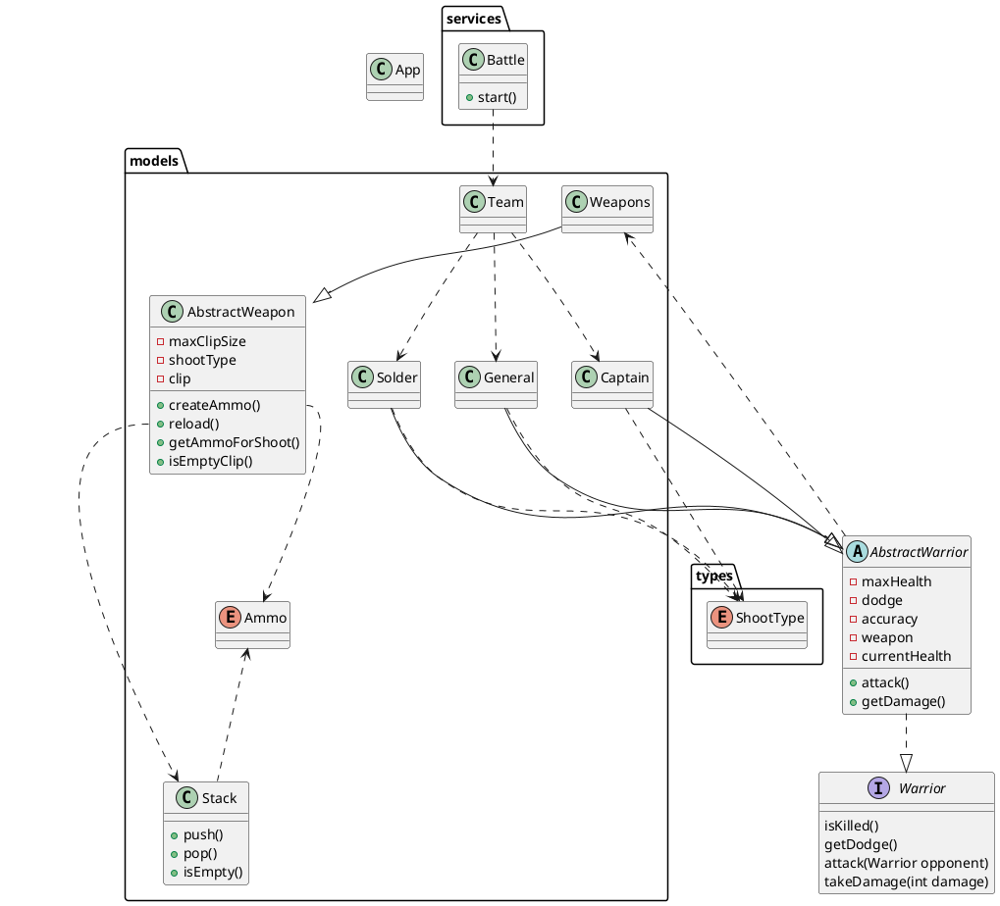

до 21 октября

# Что нужно сделать
Необходимо разработать консольную программу, которая имитирует сражение между двумя командами, отслеживает ход сражения и собирает информацию о нём.
Команда состоит из воинов, каждый из которых имеет основные характеристики и оружие в зависимости от того, к какому классу воинов он принадлежит. Например: солдат или капитан.
Сражение происходит пошагово: каждый воин из команды атакует противника из другой команды, а также может быть атакован на следующий ход противника.
Дополнительные правила сражения и критерии победы одной из команд сформулируйте и реализуйте самостоятельно. Программа должна собирать необходимую информацию и отображать в консоли текущий ход сражения.

# Советы и рекомендации
Разбивайте код на более мелкие функции, если этого требует ваша программа, даже если это не указано в задании.
По желанию вы можете добавить в программу дополнительный функционал. В этом случае обязательно сообщите об этом проверяющему преподавателю, чтобы он смог это проверить.

# Что оценивается
* Программа запускается, работает корректно и выводит всю необходимую информацию.
* Выполнены все пункты задания.
* Соблюдена инкапсуляция. Доступны только публичные члены классов.
* Классы должны быть открытыми для наследования только в случае необходимости.
* Методы должны быть открытыми для переопределения только в случае необходимости.
* Функции соответствуют принципам чёрного ящика, выполняют атомарные операции и независимы друг от друга.
* Функции возвращают неизменяемые коллекции.
* Названия компонентов программы отражают их назначение.
* Переменные, которые не изменяются в программе, должны быть объявлены неизменяемыми.
* Различные выводы в консоль начинаются с новой строки.

//www.plantuml.com/plantuml/png/RLBBRjmm3BphAtHi4En-G504ITD7WHuTe6TMPdU5w258TDjjklzUow8ZoRi-6EAG6Wx5UKW4aIPhH03r0WUKrezeadmLSlwKWPJaG7EEaVpTXYaTtzqqiGzjgDCd6-Z4q7dvevkiVBJMozS5AEVt-trXRxez_aWKGT5tXE1TqtPduS-JqM7GVx62wUWzFPz20wcvgAfH4O4mjsirHZGUnXOv8EMYppuEcVBAGBbvDrGlzUwkjfBx_VqoujMwqZpNN4nVIXA_4eDVq644quDF40Yqwy71cn5ZZpqZM4RAEVTboXvaoWvaId5-SqZ2-4ihx3to0OWCjYPPdDKz5zTaqipUKD8fC1yxPLYtceMV1QlDLsjAiDmDMlHkGBPM29aFU1rrBn2Zzd7ZjQy8XeuL6lrum1g2KbC4TQh8xsLtDPxp4HrjU6w1yiutrli85WxOFLUlhap4zX3Q4SQVe53ssdNwfet1rTYPEAlca3klLtm8tg6ZaYHuGLQX7SbnETw8ixZKyUz-RIjMl-vsCzZxVDrQd-EBw_Ak9dc7rtCFwCR9cly0

